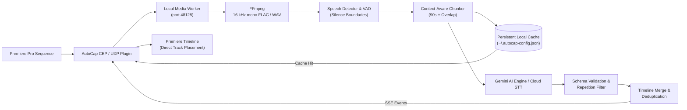

# AutoCap Product Architecture & Technical Blueprint

This document details the hybrid desktop architecture, core subsystems, data flow, and design specifications for **AutoCap** — the automated Sinhala & multilingual captioning extension for Adobe Premiere Pro.

---

## 1. System Overview

AutoCap is designed as a **hybrid desktop/local worker system** that eliminates large-file and Base64 bottlenecks while maintaining 100% Sinhala Unicode and legacy font fidelity.



---

## 2. Core Architecture Pillars

### 1. Presentation & Host Integration (Premiere Pro CEP)
- **Timeline Inspection**: Discovers all sequence audio tracks, nested sequences (recursive project item traversal), and active timeline selections via ExtendScript.
- **Direct Timeline Placement**: Automatically targets and places imported `.srt` captions onto the sequence timeline without overwriting existing video footage.
- **Subtitle Productivity Suite**:
  - **Undo / Redo Stack**: State-snapshot history for caption splits, deletes, edits, and timestamp adjustments.
  - **Batch Find & Replace**: Global regex and case-sensitive text replacement across all cards with instant match counters.
  - **Timing Conflict Repair**: One-click clamping and micro-overlap alignment (`repairTimestampOverlaps`).
  - **Legibility & Reading Speed Meter**: Real-time Characters Per Line (CPL) and Characters Per Second (CPS) metrics with visual guidelines.
  - **Single-Caption Retry**: Target-sliced re-transcription (`[🔄]`) for individual misrecognized segments without re-running the sequence.

### 2. Audio Processing & VAD (Local Media Worker)
- **Fast 16 kHz Mono Extraction**: Direct FFmpeg binary invocation producing compact, uncompressed 16-bit PCM WAV / FLAC, reducing payload sizes by up to 90%.
- **Speech Boundary Detection (`speechDetector.ts`)**:
  - Energy profiling and silence pause detection (`minSilenceMs: 500`, `minSpeechMs: 250`, `threshold: 0.5`).
  - Context chunks end strictly on detected natural pauses rather than arbitrary time cuts, avoiding sliced or truncated words.

### 3. Large Media Transfer via Gemini Files API (`geminiFilesApi.ts`)
- Eliminates Base64 encoding overhead and browser memory pressure for chunks $\ge 4\text{ MB}$.
- Utilizes Google's Resumable Upload protocol (`https://generativelanguage.googleapis.com/upload/v1beta/files`).
- Automatically deletes temporary media files in a `finally` block upon transcription completion.

### 4. Timeline Merge & Deduplication (`timelineMerger.ts`)
- **Offset Rebasing**: Transforms chunk-local timestamps into absolute sequence timestamps.
- **Overlap Window Matching**: Identifies subtitle cues inside overlap windows (typically 1.5s to 3.0s).
- **Completeness Preservation**: Levenshtein and fuzzy substring matching preserves the more complete phrase when a word is split across chunk boundaries.
- **Overlap Clamping**: Adjusts boundary timestamps so adjacent cues never collide.

### 5. Multi-Tier Persistence & Job Resumption
- **Permanent Config Storage**: Synchronous host disk persistence at `C:\Users\PC\.autocap-config.json` (survives CEP cache clears, updates, and Premiere restarts).
- **Chunk-Level Recovery (`jobRecovery.ts`)**: Caches completed chunks in real time, allowing interrupted or cancelled jobs to resume seamlessly without re-transcribing finished sections.

### 6. Standardized Server-Sent Events (SSE) Contract (`sseContract.ts`)
Standardized wire protocol connecting the Local Media Worker daemon (`127.0.0.1:48128`) and the frontend panel:
- `job_created`: `{ jobId, totalDuration, estimatedChunks }`
- `chunk_started`: `{ jobId, chunkIndex, start, end }`
- `cue`: `{ jobId, cue: SubtitleCue, chunkIndex }`
- `chunk_completed`: `{ jobId, chunkIndex, cuesCount }`
- `job_completed`: `{ jobId, totalCues, duration, cached, cues }`
- `progress`: `{ jobId, percent, message }`
- `error`: `{ jobId, code, message, retryable }`

---

## 3. Sinhala Typography & Font Encodings

AutoCap provides full bidirectional font fidelity for Sri Lankan video editors:

1. **Unicode**: Modern portable Sinhala (`U+0D80` - `U+0DFF`) for Adobe Premiere Pro Essential Graphics, captions, and web applications.
2. **Wijesekara (DL-Manel / FM-Abhaya ANSI)**: Converts Sinhala Unicode to legacy font glyphs for traditional broadcast lower-thirds and titles.
3. **Isi (IsiBasuru ANSI)**: Converts Sinhala Unicode to legacy Isi font glyphs.

### Golden-Master Regression Guarantee
The test suite in `tests/goldenSinhalaConverter.test.ts` validates:
- All 13 Sinhala diacritic combinations (පිල්ලම්): ඇලපිල්ල (ා), ඇදපිල්ල (ැ, ෑ), ඉස්පිල්ල (ි, ී), පාපිල්ල (ු, ූ), කොම්බුව (ෙ), දිග කොම්බුව (ේ), කොම්බු දෙක (ෛ), කොම්බුව හා ඇලපිල්ල (ො, ෝ), කොම්බුව හා ගයනුකිත්ත (ෞ).
- Complex ligatures (බැඳි අකුරු): Rakaransaya (ක්‍ර, ප්‍ර), Yansaya (ක්‍ය, ධ්‍ය), Repaya (ර්‍ණ, ශ්‍රී), Sanyaka (ඟ, ඬ, ඳ, ඹ), and Ksha (ක්ෂ).

---

## 4. Testing & Verification Architecture

The test suite runs under **Vitest** with 27 test suites and 161 automated unit tests:

```bash
npm run test
```

| Subsystem | Test Suite | Tests |
| :--- | :--- | :--- |
| **SSE Wire Protocol** | `tests/sseContract.test.ts` | 3 passing |
| **Worker Daemon** | `tests/workerServer.test.ts` | 4 passing |
| **Worker Client** | `tests/localWorkerClient.test.ts` | 2 passing |
| **Gemini Files API** | `tests/geminiFilesApi.test.ts` | 3 passing |
| **VAD & Silence Detection** | `tests/speechDetector.test.ts` | 2 passing |
| **Timeline Merge Engine** | `tests/timelineMerger.test.ts` | 4 passing |
| **Schema Validation** | `tests/schemaValidator.test.ts` | 4 passing |
| **Job Recovery & Cache** | `tests/jobRecovery.test.ts`, `tests/transcriptCache.test.ts` | 3 passing |
| **Settings Disk Storage** | `tests/appSettings.test.ts` | 3 passing |
| **Golden Sinhala Engine** | `tests/goldenSinhalaConverter.test.ts` | 9 passing |
| **Transliteration & Typing** | `tests/transliterator.test.ts`, `tests/transliterator-ltrl.test.ts` | 60 passing |
| **Premiere Pro Bridge** | `tests/premiereBridge.test.ts` | 7 passing |
| **Captions & Verification**| `tests/captionVerifier.test.ts`, `tests/srtParser.test.ts` | 12 passing |

---

## 5. Build and Release Pipeline

- **Build**: `tsc --noEmit && vite build` generates optimized, single-bundle assets into `dist/` and synchronizes to `cep/AutoCap/dist`.
- **Packaging**: `npm run package:cep` bundles cross-platform release archives at `release/AutoCap-1.3.1.zip` with Windows `.cmd` and macOS `.command` installers.
- **Live Installation**: `scripts/Install-AutoCap.ps1` deploys directly to `C:\Users\PC\AppData\Roaming\Adobe\CEP\extensions\AutoCap` and registers debug flags in the Windows Registry.
